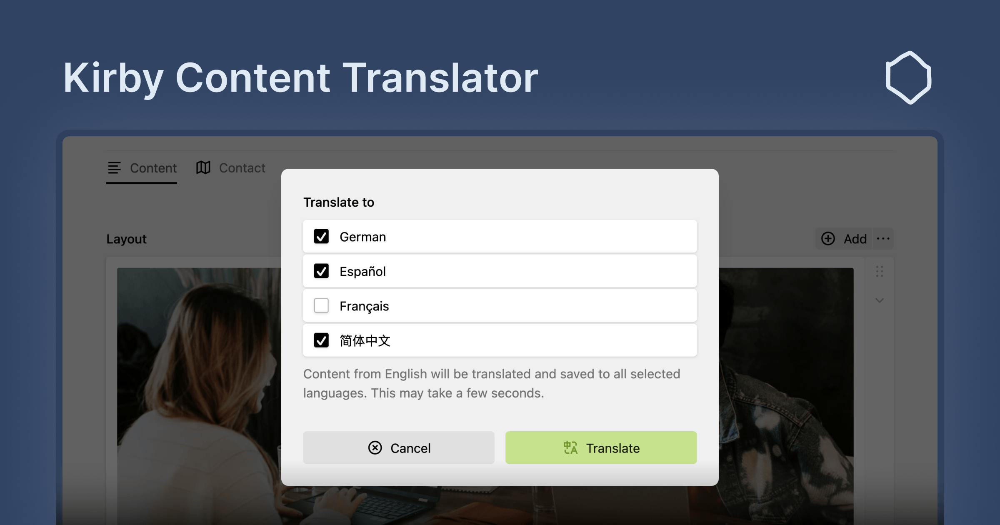

# Kirby Content Translator

The Kirby Content Translator plugin empowers editors to translate content from one language to another with a single click. Add the Panel view button to any page, file, or site blueprint and translate content directly in the Kirby Panel using [DeepL](https://www.deepl.com) or AI.

## Features

- 🖱️ **One-Click Translation**: Translate content directly from the Panel header with the view button.
- 📦 **Batch Translation**: Translate to multiple languages simultaneously from the default language.
- 📄 **All Content Types**: Translate pages, files (metadata), and site content.
- 🧩 **Structure-Aware**: Supports blocks, layouts, structures, objects, and nested fields.
- 🏷️ **KirbyTags Support**: Selectively translate KirbyTag attributes while preserving URLs and UUIDs.
- ⚡ **PHP API**: Automate translations with CLI commands or custom workflows.
- 🪝 **Hooks System**: Customize translation behavior with before/after hooks.
- 🔌 **Multiple Providers**: Built-in DeepL support, AI translation via Kirby Copilot, or custom translation services.

## Licensing

Kirby Content Translator is a commercial plugin that requires a license. You can install and test the plugin locally without a license. However, production environments require a valid license. You can purchase a license from the [Kirby Tools Website](https://kirby.tools/content-translator).

## Getting Started

To get started, please refer to the [documentation](https://kirby.tools/docs/content-translator) for guidance on installation, configuration, and usage.

## Support and Questions

We are committed to support you if you have any questions or issues with Kirby Content Translator. There are several ways to get support:

- **GitHub Discussions**: Join the community and engage in discussions on our [GitHub Discussions page](https://github.com/kirby-tools/community/discussions).
- **Email Support**: You can ask questions and seek assistance by emailing us at [hello@kirby.tools](mailto:hello@kirby.tools). Please use the GitHub discussions if you have a general question or comment about Kirby Content Translator.
- **GitHub Issues**: For reporting bugs or requesting new features, please use the [GitHub Issues page](https://github.com/kirby-tools/community/issues).

We encourage you to use the resources above to connect with us and other users of Kirby Content Translator.

For the sake of reproducible bug reports, please include the following information in your bug reports:

- Kirby & Kirby Content Translator version
- Browser environment (name, version, operating system)
- Global and section configuration (without any sensitive information)
- Steps to reproduce the bug (if no reproduction is provided)
- Screenshots or screen recordings if applicable

## Feedback

We value your feedback and ideas for improving Kirby Content Translator. If you have any suggestions, please feel free to reach out to us via email or preferably by creating a new discussion on our [GitHub Discussions page](https://github.com/kirby-tools/community/discussions).

## License

[Kirby Tools License](./LICENSE.md) License © 2024-PRESENT [Johann Schopplich](https://github.com/johannschopplich)
