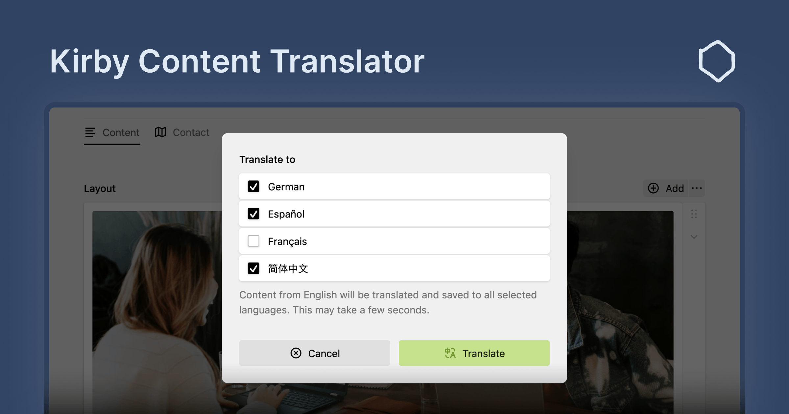

# Kirby Content Translator

The Kirby Content Translator plugin empowers editors to translate content from one language to another with a single click. Add the **Panel view button** to any page, file, or site blueprint and translate content directly in the Kirby Panel using [DeepL](https://www.deepl.com) or any [Kirby Copilot](https://kirby.tools/copilot) provider for context-aware AI translations.

For developers, the plugin offers a flexible PHP API and hooks for custom translation workflows.

## Features

- 🖱️ **One-Click Translation**: View button in any page, file, or site blueprint.
- 📦 **Batch Translation**: All target languages from one dialog, with DeepL or AI.
- 📊 **Translation Coverage**: Rings per language and the pages still missing one, in the Languages view.
- 🧩 **Nested Fields**: Walks blocks, layouts, structures, and objects – `translate: false` holds at any depth.
- 🏷️ **KirbyTags**: Tag attributes translated selectively, URLs and UUIDs preserved.
- 🔁 **Import from Source**: Copy default-language content without translating.
- 🎛️ **Configurable Scope**: By field type, or include and exclude fields, globally or per section.
- ⚡ **PHP API**: Drive translations from CLI or custom workflows, with `before`, `after`, and `warning` hooks – see [PHP classes](https://kirby.tools/docs/content-translator/php-classes).
- 🔌 **Pluggable Strategies**: DeepL, [AI via Copilot](https://kirby.tools/docs/content-translator/providers/ai-translation), or your own [custom strategy](https://kirby.tools/docs/content-translator/providers/custom-translator).

## Licensing

Kirby Content Translator is a commercial plugin that requires a license. You can install and test the plugin locally without a license. However, production environments require a valid license. You can purchase a license from the [Kirby Tools Website](https://kirby.tools/content-translator).

## Getting Started

To get started, please refer to the [documentation](https://kirby.tools/docs/content-translator) for guidance on installation, configuration, and usage.

## Support and Questions

We are committed to support you if you have any questions or issues with Kirby Content Translator. There are several ways to get support:

- **GitHub Discussions**: Join the community and engage in discussions on our [GitHub Discussions page](https://github.com/kirby-tools/community/discussions).
- **Email Support**: You can ask questions and seek assistance by emailing us at [hello@kirby.tools](mailto:hello@kirby.tools). Please use the GitHub discussions if you have a general question or comment about Kirby Content Translator.
- **GitHub Issues**: For reporting bugs or requesting new features, please use the [GitHub Issues page](https://github.com/kirby-tools/community/issues).

We encourage you to use the resources above to connect with us and other users of Kirby Content Translator.

For the sake of reproducible bug reports, please include the following information in your bug reports:

- Kirby & Kirby Content Translator version
- Browser environment (name, version, operating system)
- Global and section configuration (without any sensitive information)
- Steps to reproduce the bug (if no reproduction is provided)
- Screenshots or screen recordings if applicable

## Feedback

We value your feedback and ideas for improving Kirby Content Translator. If you have any suggestions, please feel free to reach out to us via email or preferably by creating a new discussion on our [GitHub Discussions page](https://github.com/kirby-tools/community/discussions).

## License

[Kirby Tools License](./LICENSE.md) License © 2024-PRESENT [Johann Schopplich](https://github.com/johannschopplich)
