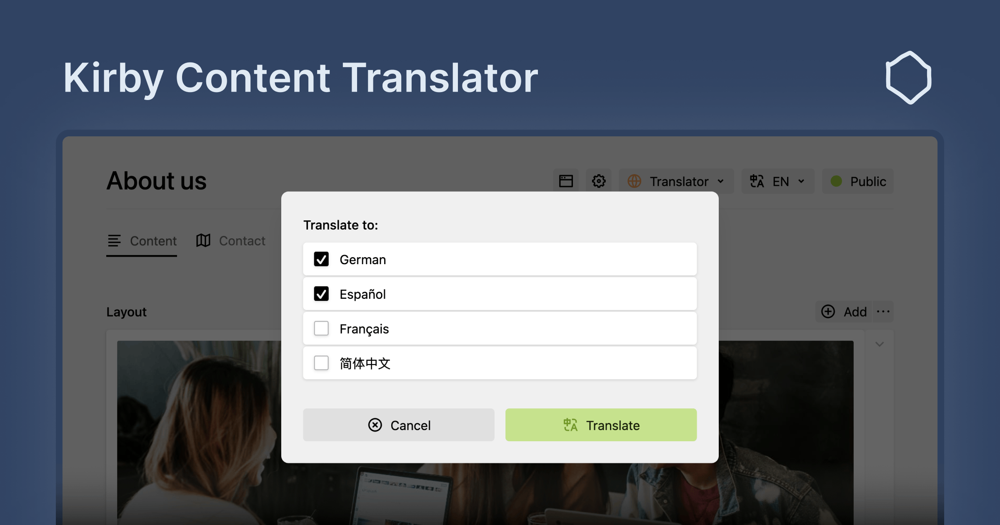

# Kirby Content Translator (Pro)

This plugin is the evolution of the now deprecated [Kirby Content Translator](https://github.com/johannschopplich/kirby-content-translator) plugin. While you can still use the old plugin, it will no longer receive updates or support. We recommend upgrading to the new Kirby Content Translator (Pro) plugin to benefit from the latest features and improvements.

## Features

- 🥟 One-click translation of content in the Panel
- ↩️ Automatically import content from primary language to secondary languages
- 🤿 Recursive translation of nested structures, objects, blocks, etc.
- 👩‍🔧 Programmatically translate content server-side
- 🌾 Supports `blocks`, `layout`, `list`, `object`, `structure`, `text`, `textarea`, `writer` fields

## Licensing

Kirby Content Translator is a commercial plugin that requires a license. You can install and test the plugin locally without a license. However, production environments require a valid license. You can purchase a license from the [Kirby Tools Website](https://kirby.tools/content-translator).

## Getting Started

To get started, please refer to the [documentation](https://kirby.tools/docs/content-translator) for guidance on installation, configuration, and usage.

## Support and Questions

We are committed to support you if you have any questions or issues with Kirby Content Translator. There are several ways to get support:

- **GitHub Discussions**: Join the community and engage in discussions on our [GitHub Discussions page](https://github.com/kirby.tools/kirby-content-translator/discussions).
- **Email Support**: You can ask questions and seek assistance by emailing us at [hello@kirby.tools](mailto:hello@kirby.tools). Please use the GitHub discussions if you have a general question or comment about Kirby Content Translator.
- **GitHub Issues**: For reporting bugs or requesting new features, please use the [GitHub Issues page](https://github.com/kirby.tools/kirby-content-translator/issues).

We encourage you to use the resources above to connect with us and other users of Kirby Content Translator.

For the sake of reproducible bug reports, please include the following information in your bug reports:

- Kirby & Kirby Content Translator version
- Browser environment (name, version, operating system)
- Global and section configuration (without any sensitive information)
- Steps to reproduce the bug (if no reproduction is provided)
- Screenshots or screen recordings if applicable

## Feedback

We value your feedback and ideas for improving Kirby Content Translator. If you have any suggestions, please feel free to reach out to us via email or preferably by creating a new discussion on our [GitHub Discussions page](https://github.com/kirby.tools/kirby-content-translator/discussions).

## License

[Kirby Tools License](./LICENSE.md) License © 2024-PRESENT [Johann Schopplich](https://github.com/johannschopplich)
